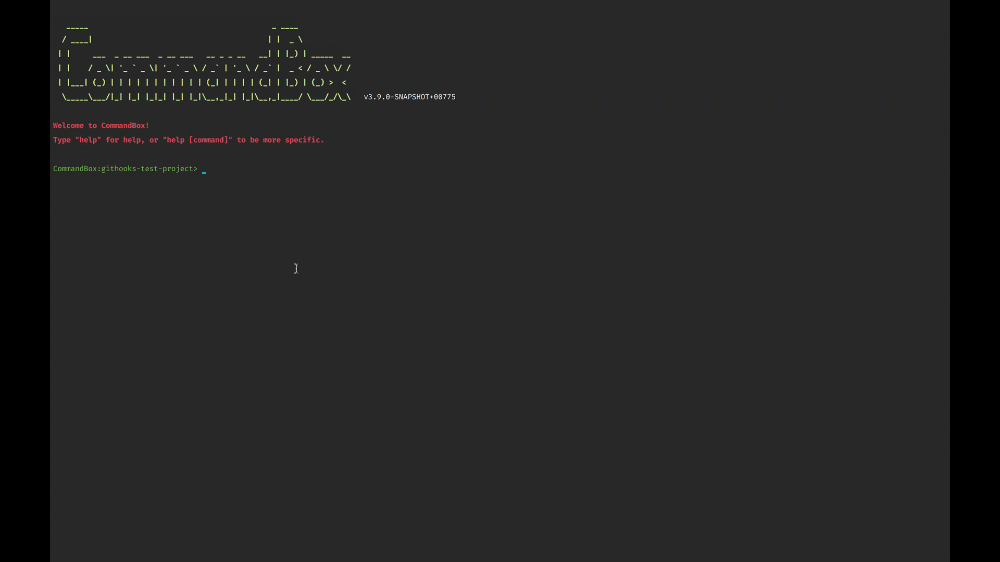

# commandbox-githooks

## Manage your git hooks with [CommandBox](https://github.com/Ortus-Solutions/commandbox)

### Installation

Install this package and set up your project to use it:

```bash
box install commandbox-githooks
cd my-git-project
box githooks install
```

Add your scripts to a `githooks` key in the `box.json`:

```json
{
  "githooks": {
    "preCommit": "testbox run",
    "postCheckout": [
      "install",
      "!npm install",
      "!gulp"
    ]
  }
}
```

### Example



Note: In order to work correctly, the path to `box` or `box.exe` must be in your system's PATH variable.
